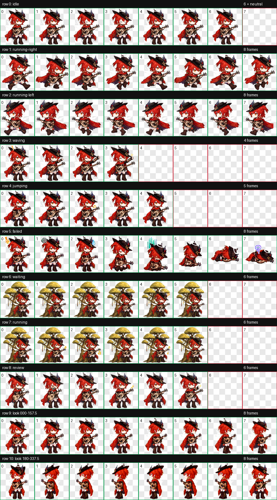
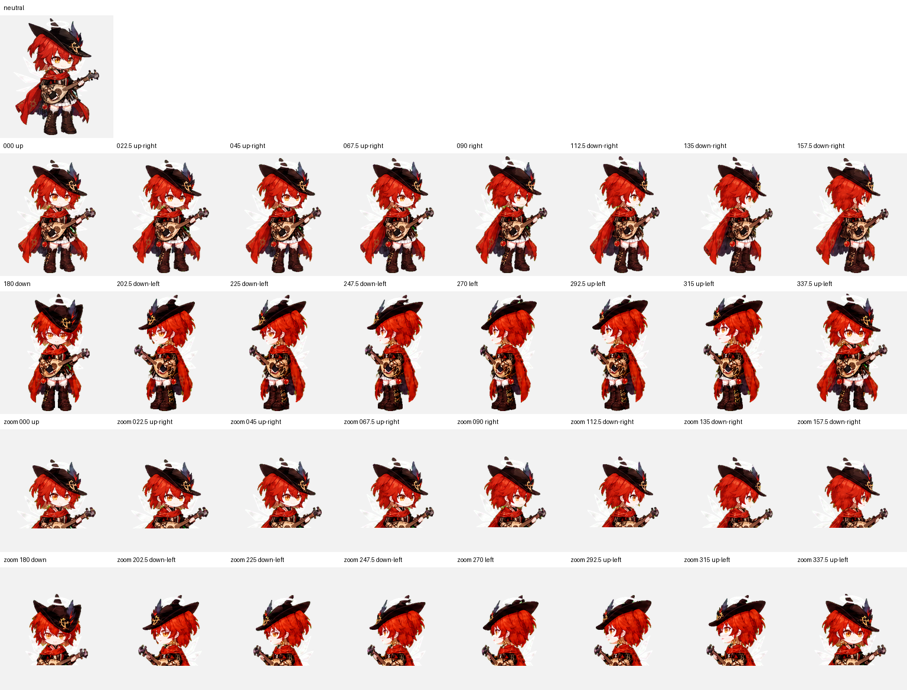

# 新约能天使-寻翼之歌 Codex 桌宠

以《明日方舟》“新约能天使·寻翼之歌”为原型制作的 Q 版 Codex 桌宠。角色保留了红发、黑色高帽、光环、白色光翼、红黑披风与鲁特琴等主要特征，并针对 Codex 的任务状态设计了九组动画。当前为 v2 图集格式，额外支持 16 个方向的视线变化。



## 主要特点

- 修长的三头半 Q 版比例，完整表现腿部、长靴、披风与光翼；
- 双向奔跑使用不同帧表现前伸与后蹬，拖动时更有移动感；
- 工作和等待动作使用同一棵宽阔分层树，角色能够自然倚靠树干；
- 保留星光、问号、音符、汗滴、困惑符号等状态反馈细节；
- 新增 16 向视线：从正上方开始，以 22.5° 为间隔覆盖一整圈；
- 所有精灵均为透明背景，适合 Codex 悬浮桌宠显示。



## 安装

### macOS / Linux

```bash
git clone https://github.com/PyrePuin/codex-pet-exusiai-seekers-song.git
cd codex-pet-exusiai-seekers-song
mkdir -p ~/.codex/pets/exusiai-seekers-song
cp pet.json spritesheet.webp ~/.codex/pets/exusiai-seekers-song/
```

### Windows PowerShell

```powershell
git clone https://github.com/PyrePuin/codex-pet-exusiai-seekers-song.git
Set-Location codex-pet-exusiai-seekers-song
$target = "$HOME\.codex\pets\exusiai-seekers-song"
New-Item -ItemType Directory -Force -Path $target | Out-Null
Copy-Item .\pet.json, .\spritesheet.webp -Destination $target -Force
```

也可以从 GitHub 下载仓库 ZIP，解压后将 `pet.json` 和 `spritesheet.webp` 复制到以下目录：

```text
~/.codex/pets/exusiai-seekers-song/
```

复制完成后，重启 Codex，打开“设置 → 外观 → Pets”，刷新自定义桌宠列表并选择“新约能天使-寻翼之歌”。随后可从桌宠入口将她唤醒或收起。

## 动作与触发状态

Codex 根据悬浮桌宠交互和任务状态选择精灵图行。不同应用版本的细节可能略有差异，但当前桌宠按照以下语义制作：

| 状态 | 触发情况 | 动作表现 | 预览 |
| --- | --- | --- | --- |
| `idle` | 没有活跃任务或需要展示的通知时 | 平稳呼吸、眨眼，头发和披风轻微摆动 |  |
| `running-right` | 向屏幕右侧水平拖动桌宠时 | 面向右侧交替迈步，披风向后展开 |  |
| `running-left` | 向屏幕左侧水平拖动桌宠时 | 面向左侧交替迈步，保持相同跑步节奏 |  |
| `waving` | 这个桌宠 ID 首次被唤醒时，播放约八秒的见面问候 | 侧身转向、wink，并做出明确的胜利手势与贴近手部的星光 |  |
| `jumping` | 桌宠发生悬浮物理弹跳或回弹时；具体是否启用取决于 Codex 版本 | 保持站立并连续、流畅地拨动鲁特琴 |  |
| `failed` | 任务失败、被阻塞或出现严重错误时 | 从惊讶、冒汗逐渐变成泄气趴下，带困惑反馈 |  |
| `waiting` | Codex 需要用户输入、确认、选择或授权时 | 倚靠树干等待、倾听并摊手询问，出现问号 |  |
| `running` | Codex 正在思考、调用工具或持续执行任务时 | 在树下持续演奏鲁特琴，音符随拨弦出现 |  |
| `review` | 任务已经完成，并有结果等待用户查看时 | 检查并调整琴弦，确认后做出肯定手势与星光 |  |

其中 `waving` 并不会在每次发送消息时触发；发送消息并开始处理后通常进入 `running`。`running-right` 和 `running-left` 表示拖动方向，而不是后台任务的执行状态。

## 图集规格

- 图集文件：`spritesheet.webp`
- 图集尺寸：1536 × 2288
- 单元格尺寸：192 × 208
- 布局：8 列 × 11 行
- 背景：RGBA 透明通道
- 图集协议：`spriteVersionNumber: 2`
- 标准动作：前 9 行，与原版动作和透明轮廓保持一致
- 视线扩展：第 10～11 行，共 16 帧，按 `000°、022.5°……337.5°` 顺时针排列

当 Codex 使用 v2 桌宠协议并需要表现观察方向时，会从这 16 帧中选取最接近的方向；普通任务状态仍使用前九行的动画。

## 文件结构

```text
.
├── README.md
├── pet.json
├── spritesheet.webp
├── preview/
│   ├── contact-sheet-v2.png
│   ├── look-directions.png
│   └── 九个动作预览 GIF
└── qa/
    └── v2 图集、方向盲测与连续性验证报告
```

真正安装时只需要 `pet.json` 和 `spritesheet.webp`；`preview` 目录用于在 GitHub 上查看动作效果。

## 同人作品说明

本项目是非官方、非商业的同人桌宠作品，与鹰角网络及《明日方舟》官方无隶属或合作关系。“明日方舟”、能天使及相关角色设定、美术元素与商标的权利归其各自权利人所有。

仓库内容仅供个人桌宠使用、学习与交流，不表示对原作角色、美术或商标授予任何再许可。如权利人对公开展示或分发有异议，请通过 GitHub Issues 联系维护者处理。
